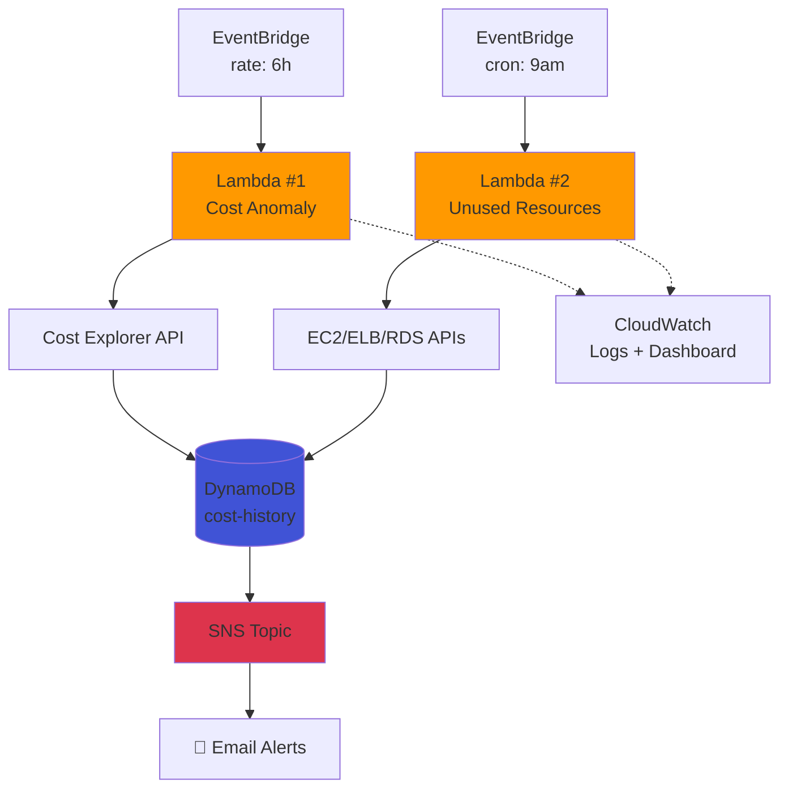
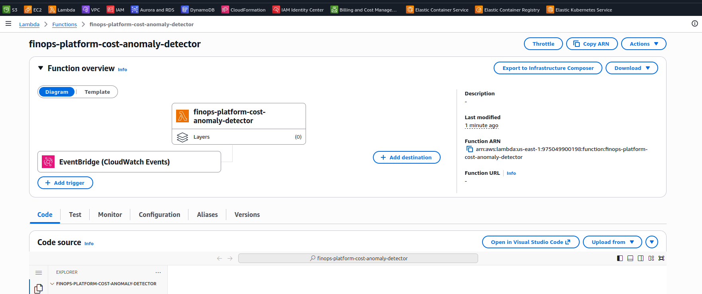
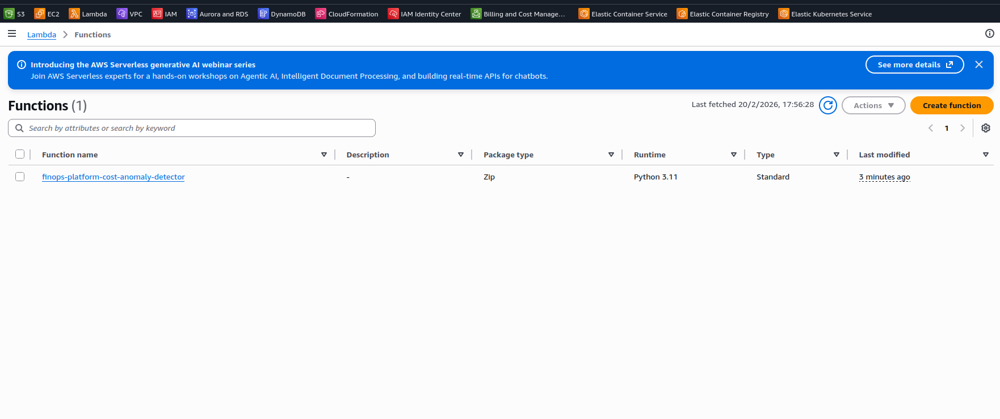
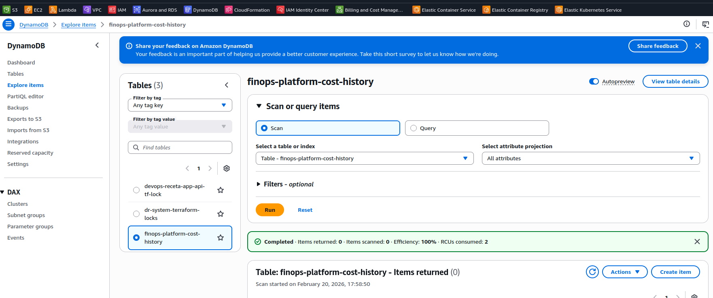
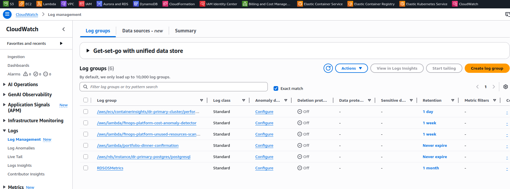
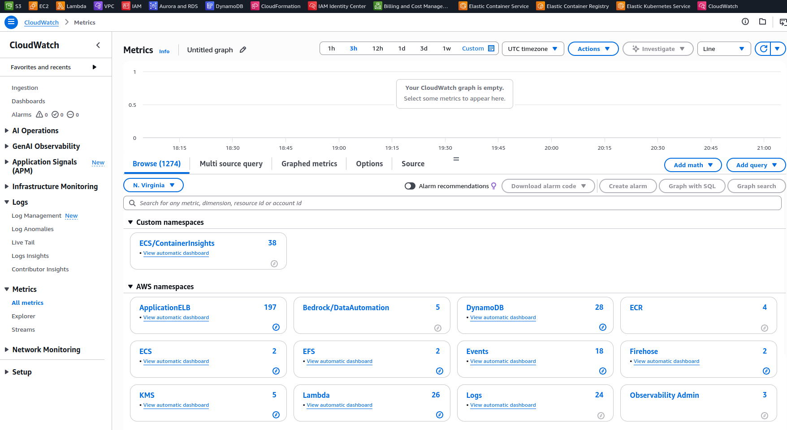
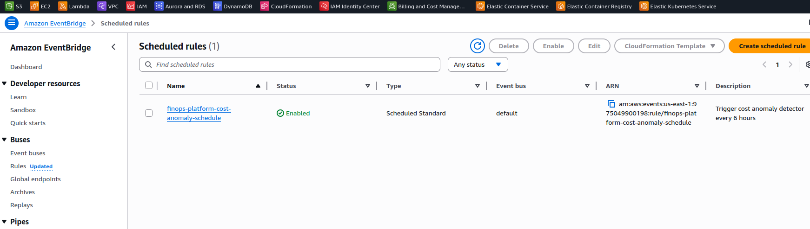
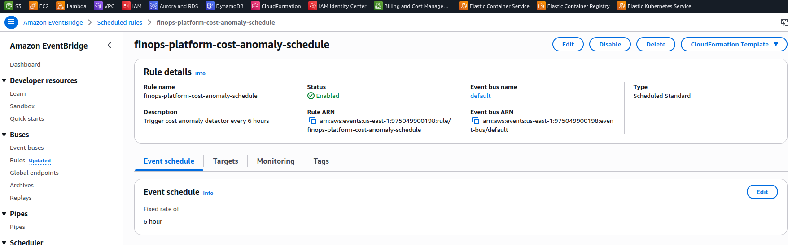
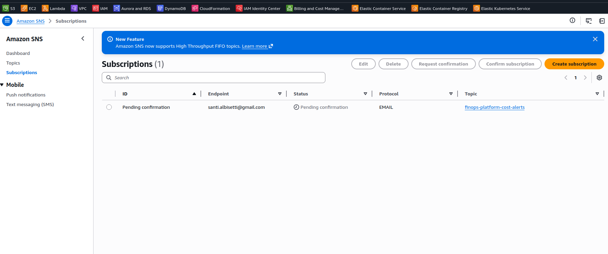
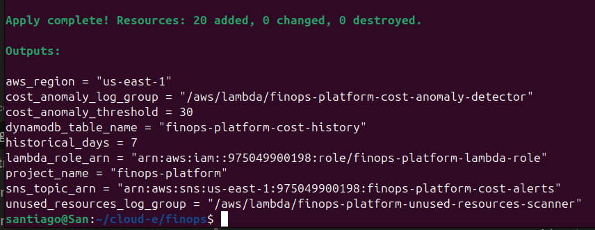

[](https://www.terraform.io/)
[](https://aws.amazon.com/)
[](https://www.python.org/)
[](https://aws.amazon.com/lambda/)
[](https://aws.amazon.com/dynamodb/)
[](LICENSE)
[](https://www.finops.org/)

# FinOps Platform - AWS Cost Monitoring & Optimization

# FinOps Platform - AWS Cost Anomaly Detection

Sistema automatizado de detección de anomalías de costos en AWS usando Lambda, Cost Explorer, y SNS.

## 📋 Descripción

Plataforma que monitorea costos AWS cada 6 horas, detecta incrementos anormales (>30%) comparando con el promedio histórico de 7 días, y envía alertas por email.


## 🏗️ Arquitectura

## 📸 Screenshots

### Lambda Functions



### DynamoDB Data


### CloudWatch Logs



### EventBridge Rules



### SNS Configuration


### Terraform Output

## 🔧 Componentes

### Infrastructure
- **SNS Topic**: canal de notificaciones encriptado
- **DynamoDB**: histórico de costos (pay-per-request)
- **IAM Role**: permisos least-privilege para Lambda
- **CloudWatch Logs**: retención 7 días
- **EventBridge**: trigger cada 6 horas
- **Lambda**: Python 3.11, 256MB, timeout 60s

### Lambda Function
- **Runtime**: Python 3.11
- **Trigger**: EventBridge (rate: 6 hours)
- **Permisos**: Cost Explorer, DynamoDB, SNS, CloudWatch Logs
- **Variables de entorno**:
  - `DYNAMODB_TABLE`: tabla de histórico
  - `SNS_TOPIC_ARN`: topic para alertas
  - `ANOMALY_THRESHOLD`: 30%
  - `HISTORICAL_DAYS`: 7 días

## 🚀 Deployment

### Prerrequisitos
- Terraform >= 1.0
- AWS CLI configurado
- Python 3.11+

### Pasos

1. **Clonar y configurar:**
```bash
cd finops
# Editar variables.tf - agregar tu email en alert_email
```

2. **Empaquetar Lambda:**
```bash
./package_lambda.sh
```

3. **Deployar infraestructura:**
```bash
terraform init
terraform plan
terraform apply
```

4. **Confirmar email:**
- Revisar inbox/spam
- Click en "Confirm subscription" del email de AWS SNS

5. **Probar:**
```bash
aws lambda invoke \
  --function-name finops-platform-cost-anomaly-detector \
  --region us-east-1 \
  response.json

cat response.json
```

## 📊 Cómo funciona

1. **EventBridge** ejecuta Lambda cada 6 horas
2. **Lambda consulta Cost Explorer:**
   - Costos de HOY por servicio
   - Costos de últimos 7 días por servicio
3. **Calcula promedio** histórico por servicio
4. **Detecta anomalías:** si hoy > promedio × 1.30 (30%)
5. **Guarda en DynamoDB** para histórico
6. **Envía alerta SNS** si hay anomalías

### Ejemplo de Alerta
```
🚨 ALERTA DE ANOMALÍA DE COSTOS 🚨

Se detectaron 2 servicios con costos anormales:

- Amazon Elastic Load Balancing: $0.05 (↑150% vs promedio $0.02)
- Amazon Relational Database Service: $0.02 (↑100% vs promedio $0.01)

Umbral de alerta: 30%
Período de comparación: últimos 7 días
```

## 📈 Verificar datos

**Ver logs de Lambda:**
```bash
aws logs tail /aws/lambda/finops-platform-cost-anomaly-detector \
  --follow --region us-east-1
```

**Ver datos en DynamoDB:**
```bash
aws dynamodb scan \
  --table-name finops-platform-cost-history \
  --region us-east-1 \
  --output table
```

**Estructura de datos guardados:**
```json
{
  "date_service": "2026-02-13#EC2",
  "timestamp": 1771014880,
  "service": "EC2",
  "cost": 45.67,
  "currency": "USD",
  "ttl": 1776198880
}
```

## 💰 Costos Estimados

| Servicio | Costo/mes |
|----------|-----------|
| Lambda (120 ejecuciones/mes × 1s) | $0.00 (free tier) |
| SNS (50 emails/mes) | $0.00 (free tier) |
| DynamoDB (on-demand, bajo volumen) | $1-2 |
| CloudWatch Logs (retención 7 días) | $0.50 |
| Cost Explorer API (120 requests) | $1.20 |
| **TOTAL** | **~$3/mes** |

## 🔒 Seguridad

- IAM roles con least privilege
- SNS encriptado con AWS managed key
- CloudWatch logs para auditoría
- DynamoDB con point-in-time recovery
- TTL en DynamoDB (datos se borran a 60 días)

## 🎯 Skills Demostrados

- ✅ Terraform (IaC)
- ✅ AWS Lambda (serverless)
- ✅ Python (boto3)
- ✅ Cost Explorer API
- ✅ DynamoDB (NoSQL)
- ✅ SNS (notificaciones)
- ✅ EventBridge (scheduling)
- ✅ IAM (permisos)
- ✅ CloudWatch (logs)
- ✅ FinOps (cost management)

## 🧹 Cleanup
```bash
terraform destroy
```

Confirmar con `yes`.

## 📝 Variables Configurables

| Variable | Default | Descripción |
|----------|---------|-------------|
| `aws_region` | us-east-1 | Región AWS |
| `environment` | dev | Ambiente |
| `project_name` | finops-platform | Nombre del proyecto |
| `alert_email` | "" | Email para alertas |
| `cost_anomaly_threshold` | 30 | % de incremento para alertar |
| `historical_days` | 7 | Días para comparación |
| `retention_days` | 7 | Retención CloudWatch logs |

## 🔄 Próximas Fases

- **Fase 2**: Lambda para detectar recursos sin usar (EBS, EIP, etc.)
- **Fase 3**: CloudWatch Dashboard con métricas visuales
- **Fase 4**: Integración con Slack

## 📚 Referencias

- [AWS Cost Explorer API](https://docs.aws.amazon.com/cost-management/latest/APIReference/API_Operations.html)
- [Lambda Best Practices](https://docs.aws.amazon.com/lambda/latest/dg/best-practices.html)
- [DynamoDB TTL](https://docs.aws.amazon.com/amazondynamodb/latest/developerguide/TTL.html)

## Fase 2: Unused Resources Scanner

### Lambda #2 - Detector de Recursos Sin Usar

**Detecta:**
- EBS volumes sin attachar
- Elastic IPs sin asignar
- Load Balancers sin targets
- RDS snapshots manuales >30 días

**Trigger:** Diario a las 9am UTC

**Ejemplo de alerta recibida:**
```
🗑️  ALERTA: RECURSOS SIN USAR DETECTADOS

Total de recursos: 2

📦 EBS Volumes sin attachar (2):
  • vol-013f3c944b957b44e - 1 GB gp2 - $0.10/mes
  • vol-0cdd0b0d59b205d9f - 1 GB gp2 - $0.10/mes

💰 Ahorro potencial: $0.20/mes
```

**Probar manualmente:**
```bash
aws lambda invoke \
  --function-name finops-platform-unused-resources-scanner \
  --region us-east-1 \
  response2.json
```

# FinOps Platform - AWS Cost Monitoring & Optimization

Sistema automatizado de monitoreo, detección de anomalías de costos y optimización de recursos en AWS.

## 📋 Descripción

Plataforma serverless que:
- ✅ Detecta anomalías de costos automáticamente (cada 6 horas)
- ✅ Identifica recursos sin usar diariamente
- ✅ Envía alertas por email vía SNS
- ✅ Almacena histórico en DynamoDB
- ✅ Visualiza métricas en CloudWatch Dashboard

## 🏗️ Arquitectura
```
┌─────────────────┐
│  EventBridge    │ ← Triggers programados
└────────┬────────┘
         │
    ┌────┴─────┐
    │          │
    ▼          ▼
┌────────┐  ┌────────┐
│Lambda 1│  │Lambda 2│
│Cost    │  │Unused  │
│Anomaly │  │Resources│
└───┬────┘  └───┬────┘
    │           │
    ├───────────┴──────────┐
    │                      │
    ▼                      ▼
┌─────────┐           ┌─────────┐
│Cost     │           │EC2/ELB/ │
│Explorer │           │RDS APIs │
└────┬────┘           └────┬────┘
     │                     │
     └──────┬──────────────┘
            ▼
     ┌─────────────┐
     │  DynamoDB   │
     │  + SNS      │
     │  + Dashboard│
     └─────────────┘
```

## 🚀 Componentes

### Infraestructura (IaC con Terraform)

| Recurso | Propósito |
|---------|-----------|
| **2× Lambda Functions** | Detección de anomalías y recursos sin usar |
| **SNS Topic** | Notificaciones por email |
| **DynamoDB Table** | Histórico de costos (TTL 60 días) |
| **IAM Role + Policies** | Permisos least-privilege |
| **2× EventBridge Rules** | Scheduling automatizado |
| **CloudWatch Logs** | Logs con retención 7 días |
| **CloudWatch Dashboard** | Visualización de métricas |
| **CloudWatch Alarm** | Alerta si Lambda tiene errores |

### Lambda #1: Cost Anomaly Detector

**Función:** Detecta incrementos anormales de costos (>30%)

**Trigger:** Cada 6 horas (rate expression)

**Proceso:**
1. Consulta Cost Explorer API → costos de HOY por servicio
2. Consulta Cost Explorer API → costos últimos 7 días
3. Calcula promedio histórico por servicio
4. Compara: si HOY > promedio × 1.30 → anomalía
5. Guarda datos en DynamoDB
6. Envía alerta SNS si hay anomalías

**Ejemplo de alerta:**
```
🚨 ALERTA DE ANOMALÍA DE COSTOS 🚨

Se detectaron 2 servicios con costos anormales:

- Amazon Elastic Load Balancing: $0.05 (↑150% vs promedio $0.02)
- Amazon Relational Database Service: $0.02 (↑100% vs promedio $0.01)

Umbral de alerta: 30%
Período de comparación: últimos 7 días
```

### Lambda #2: Unused Resources Scanner

**Función:** Detecta recursos huérfanos que generan costos

**Trigger:** Diario a las 9:00 AM UTC (cron expression)

**Detecta:**
- 📦 EBS volumes sin attachar
- 🌐 Elastic IPs sin asignar
- ⚖️ Load Balancers sin targets
- 💾 RDS snapshots manuales >30 días

**Ejemplo de alerta:**
```
🗑️  ALERTA: RECURSOS SIN USAR DETECTADOS

Total de recursos: 2

📦 EBS Volumes sin attachar (2):
  • vol-013f3c944b957b44e - 1 GB gp2 - $0.10/mes
  • vol-0cdd0b0d59b205d9f - 1 GB gp2 - $0.10/mes

💰 Ahorro potencial: $0.20/mes
```

### CloudWatch Dashboard

**Widgets incluidos:**
- Invocations, Errors, Duration de ambas Lambdas
- DynamoDB read/write operations
- SNS messages sent/failed
- Recent anomaly alerts (Logs Insights)
- Unused resources detection log (Logs Insights)
- Custom metrics: AnomaliesDetected, ServicesChecked

## 📊 Deployment

### Prerrequisitos
```bash
# Terraform >= 1.0
terraform version

# AWS CLI configurado
aws sts get-caller-identity

# Python 3.11+
python3 --version
```

### Instalación

**1. Clonar repositorio:**
```bash
git clone <repo-url>
cd finops
```

**2. Configurar email para alertas:**

Editar `variables.tf` línea 27:
```hcl
variable "alert_email" {
  default = "tu@email.com"  # ← Cambiar aquí
}
```

**3. Empaquetar Lambdas:**
```bash
chmod +x package_lambda.sh
./package_lambda.sh
```

**4. Deployar infraestructura:**
```bash
terraform init
terraform plan
terraform apply
```

**5. Confirmar subscription SNS:**
- Revisar email inbox/spam
- Click en "Confirm subscription" del email AWS SNS

**6. Verificar deployment:**
```bash
# Probar Lambda #1
aws lambda invoke \
  --function-name finops-platform-cost-anomaly-detector \
  --region us-east-1 \
  response1.json

# Probar Lambda #2
aws lambda invoke \
  --function-name finops-platform-unused-resources-scanner \
  --region us-east-1 \
  response2.json

# Ver logs
aws logs tail /aws/lambda/finops-platform-cost-anomaly-detector \
  --follow --region us-east-1
```

## 💡 Verificación de Datos

**DynamoDB - histórico de costos:**
```bash
aws dynamodb scan \
  --table-name finops-platform-cost-history \
  --region us-east-1 \
  --output table
```

**Estructura de datos:**
```json
{
  "date_service": "2026-02-13#EC2",
  "timestamp": 1771014880,
  "service": "EC2", 
  "cost": 45.67,
  "currency": "USD",
  "ttl": 1776198880
}
```

**CloudWatch Dashboard:**

Después del `terraform apply`, copiar la URL del output:
```
dashboard_url = "https://console.aws.amazon.com/cloudwatch/home?region=us-east-1#dashboards:name=finops-platform-cost-dashboard"
```

## 💰 Costos Estimados

| Servicio | Uso Mensual | Costo |
|----------|-------------|-------|
| Lambda Cost Anomaly | 120 invocations × 1s | $0.00 (free tier) |
| Lambda Unused Resources | 30 invocations × 2s | $0.00 (free tier) |
| SNS | 50 emails | $0.00 (free tier) |
| DynamoDB | on-demand, bajo volumen | $1-2 |
| CloudWatch Logs | 7 días retención | $0.50 |
| CloudWatch Dashboard | 1 dashboard | $3.00 |
| Cost Explorer API | 150 requests | $1.50 |
| CloudWatch Alarm | 1 alarm | $0.10 |
| **TOTAL** | | **~$5-7/mes** |

## 🔒 Seguridad

- ✅ IAM roles con principio de least privilege
- ✅ SNS topic encriptado con AWS managed key
- ✅ DynamoDB con point-in-time recovery
- ✅ CloudWatch logs para auditoría completa
- ✅ TTL en DynamoDB (auto-delete después 60 días)
- ✅ No hardcoded credentials

## 🎯 Skills Demostrados

### Cloud Engineering
- ✅ AWS Lambda (serverless compute)
- ✅ EventBridge (event-driven architecture)
- ✅ DynamoDB (NoSQL database design)
- ✅ SNS (notification systems)
- ✅ CloudWatch (observability + dashboards)
- ✅ Cost Explorer API (billing automation)

### DevOps
- ✅ Terraform (Infrastructure as Code)
- ✅ Python + boto3 (automation)
- ✅ IAM (security & permissions)
- ✅ Bash scripting

### FinOps
- ✅ Cost anomaly detection
- ✅ Resource optimization
- ✅ Automated alerting
- ✅ Cost tracking & reporting

## 📁 Estructura del Proyecto
```
finops/
├── terraform/
│   ├── provider.tf              # AWS provider config
│   ├── variables.tf             # Input variables
│   ├── sns.tf                   # SNS topic + subscription
│   ├── dynamodb.tf              # DynamoDB table
│   ├── iam.tf                   # IAM roles & policies
│   ├── cloudwatch.tf            # Log groups
│   ├── lambda_cost_anomaly.tf   # Lambda #1 + EventBridge
│   ├── lambda_unused_resources.tf # Lambda #2 + EventBridge
│   ├── dashboard.tf             # CloudWatch Dashboard
│   ├── metrics.tf               # Custom metrics + alarms
│   ├── outputs.tf               # Output values
│   └── .gitignore
│
├── lambdas/
│   ├── lambda_cost_anomaly.py   # Cost anomaly detector
│   └── lambda_unused_resources.py # Unused resources scanner
│
├── scripts/
│   └── package_lambda.sh        # Lambda packaging script
│
└── README.md
```

## 🧪 Testing

**Crear recurso de prueba (EBS volume):**
```bash
aws ec2 create-volume \
  --size 1 \
  --availability-zone us-east-1a \
  --region us-east-1
```

**Invocar Lambda para detectarlo:**
```bash
aws lambda invoke \
  --function-name finops-platform-unused-resources-scanner \
  --region us-east-1 \
  response.json

cat response.json
# Debería mostrar: "total_unused": 1
```

**Eliminar recurso de prueba:**
```bash
aws ec2 delete-volume --volume-id vol-xxxxx --region us-east-1
```

## 🧹 Cleanup
```bash
terraform destroy
```

**Nota:** Terraform NO elimina:
- Recursos creados manualmente (EBS volumes, EIPs, etc.)
- CloudWatch Logs después de 7 días (se borran automáticamente)

## 🔄 Roadmap / Mejoras Futuras

- [ ] Integración con Slack (reemplazar SNS)
- [ ] Filtrado por tags específicos
- [ ] Umbrales personalizables por servicio
- [ ] Machine learning para predicción de costos
- [ ] Multi-región support
- [ ] Terraform modules para reutilización
- [ ] CI/CD con GitHub Actions

## 📝 Variables Configurables

| Variable | Default | Descripción |
|----------|---------|-------------|
| `aws_region` | us-east-1 | Región AWS |
| `environment` | dev | Ambiente (dev/prod) |
| `project_name` | finops-platform | Nombre del proyecto |
| `alert_email` | "" | Email para alertas SNS |
| `cost_anomaly_threshold` | 30 | % incremento para alertar |
| `historical_days` | 7 | Días para comparación |
| `retention_days` | 7 | Retención CloudWatch logs |

## 📚 Referencias

- [AWS Cost Explorer API](https://docs.aws.amazon.com/cost-management/latest/APIReference/API_Operations.html)
- [Lambda Best Practices](https://docs.aws.amazon.com/lambda/latest/dg/best-practices.html)
- [DynamoDB TTL](https://docs.aws.amazon.com/amazondynamodb/latest/developerguide/TTL.html)
- [EventBridge Scheduling](https://docs.aws.amazon.com/eventbridge/latest/userguide/eb-create-rule-schedule.html)
- [Terraform AWS Provider](https://registry.terraform.io/providers/hashicorp/aws/latest/docs)

## 👤 Autor

**Santiago** - Cloud Engineer / Cybersecurity Professional

Portfolio: [GitHub](https://github.com/tu-usuario)

## 📄 Licencia

Este proyecto es de código abierto para propósitos educativos y de portfolio.
